<p align="center">
  
</p>

<h1 align="center">🏦 FinAI — Multi-Agent Quantitative Finance Platform</h1>

<p align="center">
  <b>Enterprise-grade agentic AI system for real-time quantitative analysis, portfolio optimization, and intelligent market research — powered by autonomous tool orchestration.</b>
</p>

<p align="center">
  
  
  
  
</p>

<p align="center">
  <a href="#-key-capabilities">Capabilities</a> •
  <a href="#-quantitative-analysis-engine">Quant Engine</a> •
  <a href="#%EF%B8%8F-multi-agent-architecture">Architecture</a> •
  <a href="#-quick-start">Quick Start</a> •
  <a href="#-skills-demonstrated">Skills</a>
</p>

---

## 📸 Live Demo Showcase

<table>
  <tr>
    <td align="center" width="50%">
      <br/>
      <b>📊 Portfolio Analysis</b><br/>
      <sub>Real-time P&L, sector allocation, risk metrics</sub>
    </td>
    <td align="center" width="50%">
      <br/>
      <b>🧠 Investment Analysis</b><br/>
      <sub>Bull/Bear case, valuation, recommendations</sub>
    </td>
  </tr>
</table>

<p align="center">
  <i>✨ These are real outputs — not mockups. The agent autonomously chains multiple tools to generate comprehensive analysis.</i>
</p>

---

## 🎯 The Value Proposition

> **What if you could give any investor—from retail to institutional—access to the same quantitative analysis capabilities that hedge funds use?**

FinAI is not a chatbot. It's an **autonomous multi-agent system** that:
- Performs **real-time quantitative analysis** on any portfolio
- Retrieves and processes **live market data** from institutional-grade APIs
- Executes **complex multi-step reasoning** to synthesize financial insights
- Scales **infinitely** through a modular, API-driven tool architecture

**This is what Level 3 Autonomous AI looks like in production fintech.**

---

## ❌ The Problem with Current AI Solutions

| Challenge | ChatGPT / Gemini / Claude | FinAI Solution |
|-----------|---------------------------|----------------|
| **Real-time market data** | ❌ Knowledge cutoff, no live access | ✅ Live API integration via OpenBB |
| **Quantitative analysis** | ❌ Can only describe concepts | ✅ Executes calculations on real data |
| **Portfolio-level insights** | ❌ Generic advice only | ✅ Personalized P&L, sector allocation, risk metrics |
| **Multi-step reasoning** | ❌ Single response, no chaining | ✅ Autonomous tool orchestration |
| **Extensibility** | ❌ Closed system | ✅ Unlimited custom tools via modular framework |

---

## 🚀 Key Capabilities

### 📊 Real-Time Quantitative Analysis

The platform performs institutional-grade quantitative analysis on demand — see the **Live Demo Showcase** above for real output examples.

**Capabilities include:**
- Real-time portfolio valuation with live market prices
- Daily P&L calculation with automatic after-hours handling
- Sector allocation breakdown and concentration risk analysis
- Personalized investment recommendations based on holdings

### 📈 Historical Market Data Retrieval

- **Time Series Analysis**: Up to 5 years of OHLCV data
- **Performance Calculation**: Automated return computation
- **Trend Detection**: Price movement analysis across any timeframe

### 🔥 Market Intelligence

| Capability | Data Points |
|------------|-------------|
| **Top Gainers/Losers** | Real-time daily movers across all exchanges |
| **Sector Analysis** | Performance breakdown by GICS sector |
| **Company Fundamentals** | P/E, EPS, market cap, dividend yield |
| **Comparative Analysis** | Side-by-side stock comparisons |

---

## ⚙️ Multi-Agent Architecture

FinAI implements a **production-grade multi-agent system** using the ReAct (Reason + Act) pattern:

```mermaid
flowchart TD
    A["👤 User Query"] --> B["🧠 Reasoning Engine<br/>Gemini 3 Flash Preview"]
    B --> C["🔍 Intent Classification"]
    C --> D["🛠️ Tool Orchestration<br/>LangChain ReAct Agent"]
    D --> E["📊 get_stock_quote"]
    D --> F["📈 analyze_portfolio"]
    D --> G["🔥 get_top_gainers"]
    D --> H["🏢 get_company_profile"]
    D --> I["📉 get_historical_data"]
    E & F & G & H & I --> J["📊 Data Synthesis"]
    J --> K["💬 Response to User"]
```



**Key Capabilities:**
- **Natural Language Understanding** — Parses complex financial queries
- **Intent Classification** — Routes to appropriate tools
- **Multi-step Planning** — Chains tools for complex analysis
- **Context-Aware Responses** — Adapts to market hours, data freshness


### Why This Architecture Matters

| Design Principle | Implementation | Business Value |
|------------------|----------------|----------------|
| **Modularity** | Each tool is independent, testable unit | Add new capabilities without touching core |
| **Scalability** | Stateless API design, async-ready | Handle 1000s of concurrent users |
| **Extensibility** | `@tool` decorator pattern | Unlimited custom tools in <10 lines each |
| **Fault Tolerance** | Graceful degradation on API failures | Production reliability |
| **Context Awareness** | Market hours detection, data freshness | Intelligent response adaptation |

---

## 🧠 Advanced NLP Capabilities

### Context-Aware Response Generation

The system doesn't just execute functions—it **understands context**:

```python
# Example: Market Hours Awareness
if market_closed:
    response = "As of market close, AAPL traded at $261.05"
else:
    response = "AAPL is currently trading at $261.05"

# Example: Data Freshness Handling  
if realtime_change == 0:  # After hours
    # Automatically fetch historical data
    calculate_from_previous_close()
```

### Beyond Predefined Functions

The agent handles queries **outside its explicit tool definitions**:

```
User: "Should I buy TSLA right now?"

Agent Reasoning:
1. This requires: current price, recent trend, fundamentals
2. Tools needed: get_stock_quote() + get_historical_data() + get_financial_metrics()
3. Synthesize: Combine data points into investment insight
4. Respond: Balanced analysis with actual data, not generic advice
```

---

## 🔧 Technical Implementation

### Technology Stack

| Layer | Technology | Purpose |
|-------|------------|---------|
| **LLM** | Gemini 3 Flash Preview | Reasoning, NLU, response generation |
| **Agent Framework** | LangGraph 1.0+ | ReAct pattern, tool orchestration |
| **NLP Pipeline** | LangChain Core | Prompt engineering, memory management |
| **Market Data** | OpenBB Platform | Institutional-grade financial APIs |
| **Data Provider** | yfinance | Zero-cost real-time quotes |
| **Backend** | Flask + CORS | RESTful API server |
| **Frontend** | Custom HTML/CSS/JS | Professional dark-themed UI |

### Quantitative Tools Implemented

```python
# 9 Production-Ready Financial Tools

@tool
def get_stock_quote(ticker: str) -> str:
    """Real-time price, volume, market cap, daily changes"""

@tool  
def analyze_portfolio(holdings: str) -> str:
    """Multi-stock P&L, sector allocation, risk metrics"""

@tool
def get_historical_data(ticker: str, period: str) -> str:
    """OHLCV time series with performance calculations"""

@tool
def get_top_gainers() -> str:
    """Today's biggest market movers"""

@tool
def get_top_losers() -> str:
    """Today's largest decliners"""

@tool
def compare_stocks(tickers: str) -> str:
    """Side-by-side fundamental comparison"""

@tool
def get_company_profile(ticker: str) -> str:
    """Sector, industry, description, key stats"""

@tool
def get_financial_metrics(ticker: str) -> str:
    """P/E, EPS, dividend yield, market cap"""

@tool
def analyze_market_sector(sector: str) -> str:
    """Sector-level performance analysis"""
```

### Extensibility: Adding New Tools

The framework is designed for **unlimited tool integration**:

```python
# Adding a new tool takes <10 lines of code

@tool
def get_options_chain(ticker: str, expiry: str) -> str:
    """Fetch options with Greeks calculation"""
    data = obb.derivatives.options.chains(symbol=ticker, ...)
    # Process and return
    return json.dumps(result)

# That's it. The agent automatically:
# 1. Discovers the new tool
# 2. Understands when to use it (via docstring)
# 3. Integrates it into multi-step reasoning
```

---

## 📁 Project Structure

```
finai/
├── app.py                 # Core application (580+ lines)
│   ├── Tool Definitions   # 9 quantitative finance tools
│   ├── Agent Setup        # LangGraph ReAct configuration
│   ├── Flask API          # RESTful endpoints
│   └── Error Handling     # Graceful degradation
│
├── chatbot_cli.py         # CLI interface for testing/debugging
│
├── templates/
│   └── chat.html          # Production UI (680+ lines)
│       ├── Markdown Parser    # Tables, headers, formatting
│       ├── Real-time Updates  # Async message handling
│       └── Professional Theme # Dark mode, fintech aesthetic
│
├── assets/
│   └── demo.png           # Demo screenshot
│
├── requirements.txt       # Dependency management
├── .env.example           # Environment template
├── .gitignore             # Security best practices
├── LICENSE                # MIT License
└── README.md              # This documentation
```

---

## 🚀 Quick Start

### Prerequisites
- Python 3.10+
- Gemini API key ([Get free](https://aistudio.google.com/))

### Installation

```bash
git clone https://github.com/akshaysapkale007/finai.git
cd finai
python -m venv venv && source venv/bin/activate
pip install -r requirements.txt
cp .env.example .env  # Add your GOOGLE_API_KEY
python app.py
```

Open **http://127.0.0.1:5000**

---

## 🎓 Skills Demonstrated

| Category | Skills |
|----------|--------|
| **Agentic AI** | Multi-agent systems, ReAct pattern, tool orchestration, autonomous reasoning |
| **LLM Engineering** | Prompt engineering, function calling, context management, Gemini integration |
| **Quantitative Finance** | Portfolio analysis, risk metrics, market data processing, financial calculations |
| **NLP** | Intent classification, context-aware responses, multi-step reasoning |
| **Backend Development** | Flask, RESTful APIs, async patterns, error handling |
| **API Integration** | OpenBB, yfinance, multi-provider architecture |
| **Full-Stack** | Python, JavaScript, HTML/CSS, responsive design |
| **DevOps** | Environment management, dependency handling, production-ready structure |

---

## � Version History

This project has evolved significantly since its first version in early 2025.

### v2.0 — Current Release (January 2026)
**Complete architectural overhaul** with modern tooling and enhanced capabilities.

### v1.0 — Original Implementation (Early 2025)
Built when LangChain was still pre-v1.0 and AI coding assistants weren't yet in IDEs.

| Aspect | v1.0 (2025) | v2.0 (2026) |
|--------|-------------|-------------|
| **LLM** | Gemini 1.5 Flash | Gemini 3 Flash Preview |
| **Agent Framework** | `create_tool_calling_agent` | ReAct pattern with `create_react_agent` |
| **Data Provider** | OpenBB (paid API key required) | OpenBB + yfinance (free) |
| **Web Search** | Tavily API (paid) | Removed (not needed) |
| **Import Paths** | `from langchain.chat_models` | `from langchain_google_genai` |
| **Tools** | 4 basic tools | 9 production tools + extensible |
| **Frontend** | Basic HTML | Professional dark-themed UI |
| **Unique Features** | None | Portfolio analyzer, top gainers/losers |

### Why the Rebuild?

The v1 codebase broke due to:
1. **LangChain breaking changes** — Import paths completely restructured in v1.0
2. **OpenBB API changes** — Authentication method deprecated
3. **Dependency evolution** — Required complete refactor, not just patches

> 💡 **Lesson Learned**: This experience taught me the importance of abstraction layers, dependency pinning, and building resilient architectures that can survive library updates.

📁 See [`v1-legacy/`](v1-legacy/) for the original code (preserved for reference).

---

## �🔮 Roadmap

- [ ] **Options Analytics** — Greeks calculation, IV analysis, strategy builder
- [ ] **Technical Indicators** — RSI, MACD, Bollinger Bands, moving averages
- [ ] **Backtesting Engine** — Historical strategy simulation
- [ ] **Multi-User Persistence** — Portfolio storage, watchlists, alerts
- [ ] **Streaming Data** — WebSocket integration for real-time updates

---

## 📄 License

MIT License — see [LICENSE](LICENSE)

---

<p align="center">
  <b>Built by <a href="https://github.com/akshaysapkale007">Akshay Sapkale</a></b><br/>
  <i>Autonomous AI • Quantitative Finance • Production-Ready</i>
</p>
